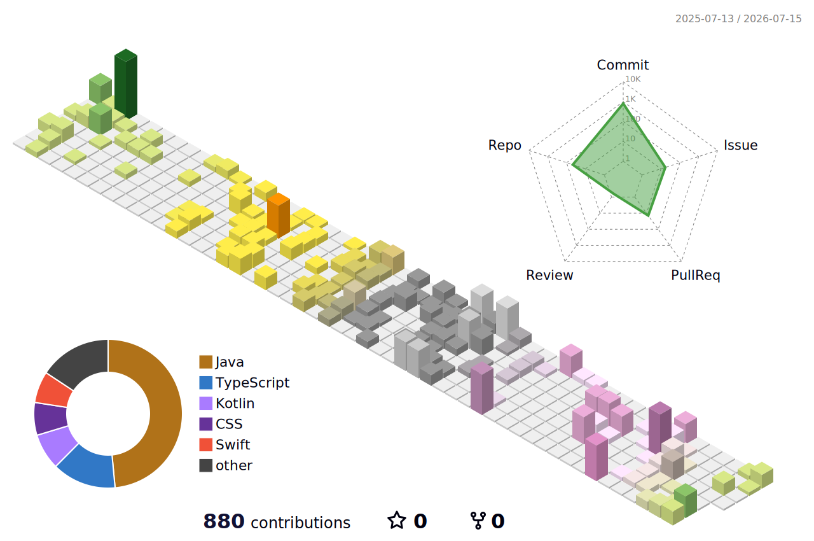

# pgkim42

Full-stack developer combining Computer Science fundamentals with coding agents like Codex and Claude.

Reason, test, and ship with AI agents.

  
  
  
   
  
  
  

## Contributions

<picture>
  <source media="(prefers-color-scheme: dark)" srcset="./profile-3d-contrib/profile-night-rainbow.svg" />
  
</picture>

<picture>
  <source media="(prefers-color-scheme: dark)" srcset="https://raw.githubusercontent.com/pgkim42/pgkim42/output/github-snake-dark.svg" />
  
</picture>

<picture>
  <source media="(prefers-color-scheme: dark)" srcset="https://github-readme-activity-graph.vercel.app/graph?username=pgkim42&bg_color=00000000&color=c0caf5&line=7aa2f7&point=bb9af7&area=true&area_color=414868&hide_border=true" />
  
</picture>
