  

  

  Software Engineer combining Computer Science fundamentals with coding agents like Codex and Claude.

  
  
  
  
  
  

---

## 🌱 Contribution Garden

  <picture>
    <source media="(prefers-color-scheme: dark)" srcset="./profile-3d-contrib/profile-night-rainbow.svg" />
    
  </picture>

  <picture>
    <source media="(prefers-color-scheme: dark)" srcset="https://raw.githubusercontent.com/pgkim42/pgkim42/output/github-snake-dark.svg" />
    
  </picture>

  <picture>
    <source media="(prefers-color-scheme: dark)" srcset="https://github-readme-activity-graph.vercel.app/graph?username=pgkim42&bg_color=00000000&color=c0caf5&line=7aa2f7&point=bb9af7&area=true&area_color=414868&hide_border=true" />
    
  </picture>

## 📊 Stats

  
  

  <picture>
    <source media="(prefers-color-scheme: dark)" srcset="https://streak-stats.demolab.com/?user=pgkim42&theme=tokyonight&hide_border=true&background=00000000" />
    
  </picture>

## 🏆 Trophies

  <picture>
    <source media="(prefers-color-scheme: dark)" srcset="https://github-profile-trophy.vercel.app/?username=pgkim42&theme=tokyonight&no-frame=true&no-bg=true&column=7&margin-w=8" />
    
  </picture>

  

